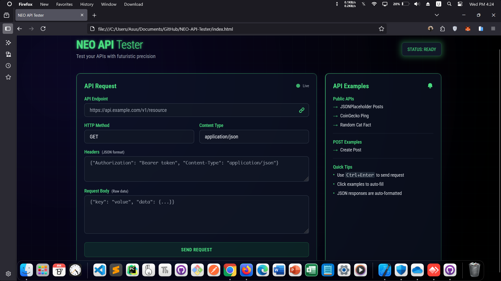

<!-- README.md -->

<a href="https://amirhosseingholami-dev.github.io/NEO-API-Tester/" target="_blank" style="text-decoration: none; color: inherit;">

<h3>NEO-API-Tester</h3>
</a>

Futuristic API testing tool built with HTML, TailwindCSS, and JavaScript. Features include custom headers, body, methods, real-time status, response preview, copy response, and example APIs. Sleek glassmorphism design with neon effects and responsive layout.

<a href="https://amirhosseingholami-dev.github.io/NEO-API-Tester/" target="_blank">🎯 Live demo</a> ·
<a href="https://github.com/AmirHosseinGholami-DEV/NEO-API-Tester/" target="_blank">💻 Source</a>

